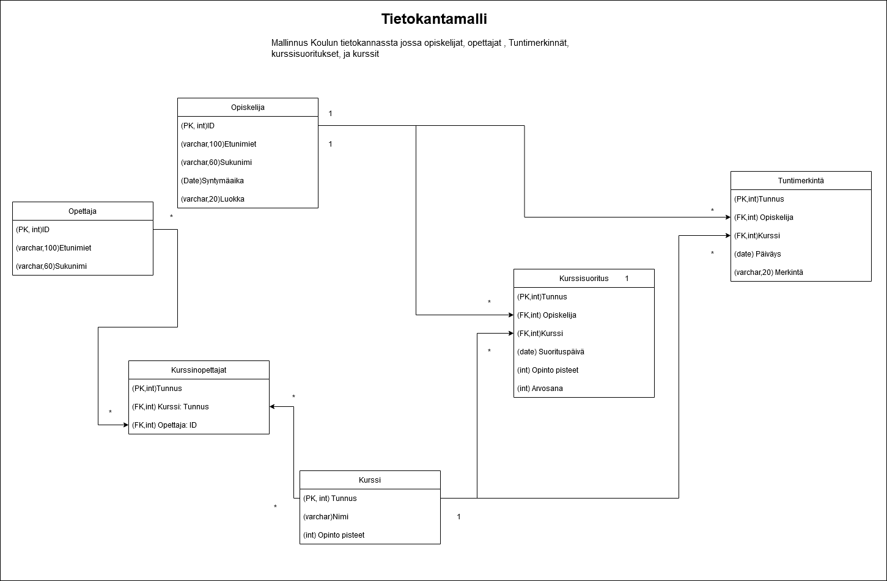

# Relaatio tietokanta projekti:
- Aiheena Koulun tietokanta.
- Malli Draw.io
- Vähintään 5 taulua.
- Frontendillä ei väliä (react + electron)
- MySql Tietokantana

## Malli taulu 

## Tietokanta on lokaali Mysql Server.
Serveri on tehty tämän sivun ohjeiden mukaan. https://www.prisma.io/dataguide/mysql/setting-up-a-local-mysql-database
Kun serveri on valmis sen voi käynnistää MySql command clientissä johon laitetaan serverin salasana ja se käynnistyy.

Lisäsin serverille teitokannan komenolla CREATE DATABASE RelationDB
Sen jälkeen menin databaseen USE RelationDB ja aloin lisämään sinne tauluja:

- CREATE TABLE Student (ID integer PRIMARY KEY, Forenames varchar(100), Surname varchar(60), Birthdate date)
- CREATE TABLE Course (ID integer PRIMARY KEY, name varchar(100), points integer)
- CREATE TABLE Teacher (ID integer PRIMARY KEY, Forenames varchar(100), Surname varchar(60))
- CREATE TABLE Courseteachers (ID integer , TeacherID integer, CourseID integer, PRIMARY KEY (ID), FOREIGN KEY (TeacherID) REFERENCES Teacher(ID),FOREIGN KEY (CourseID) REFERENCES Course(ID))
- CREATE TABLE Classaddentance (ID integer, StudentID integer, CourseID integer, Madedate Date, Mark varchar(20),
PRIMARY KEY (ID), FOREIGN KEY (StudentID) REFERENCES Student(ID),FOREIGN KEY (CourseID) REFERENCES Course(ID)) 
- CREATE TABLE Coursecomplete (ID integer, StudentID integer, CourseID integer, Completedate Date, Points integer, Grade integer,
PRIMARY KEY (ID), FOREIGN KEY (StudentID) REFERENCES Student(ID),FOREIGN KEY (CourseID) REFERENCES Course(ID)) 

Huomasin että minulta puuttuikin Student taulusta yksi sarake ja lisäsin sen. ALTER TABLE Student ADD Class varchar(20)
Huomasin myös että oisi kannattanut pistää taulujen id NOT NULL ja AUTO_INCREMENT mutta lisäystä ei voinut tehdä kun ID on jo FOREIGN KEY
muutamassa taulussa. Tämän voi ohittaa käyttämällä SET FOREIGN_KEY_CHECKS = 0 , tekemällä asiat ja sitten tarkistus takaisin SET FOREIGN_KEY_CHECKS = 1 ja muutokset tein tällä tyylillä ALTER TABLE Classaddentance MODIFY ID integer NOT NULL AUTO_INCREMENT

Seuraavaksi lisäsin yhden rivin Student tauluun jotta voin testata yhteyttä.

Käytin projektissa pohjana omaa Electron-React yhdistelmää node.js localhost serverillä.