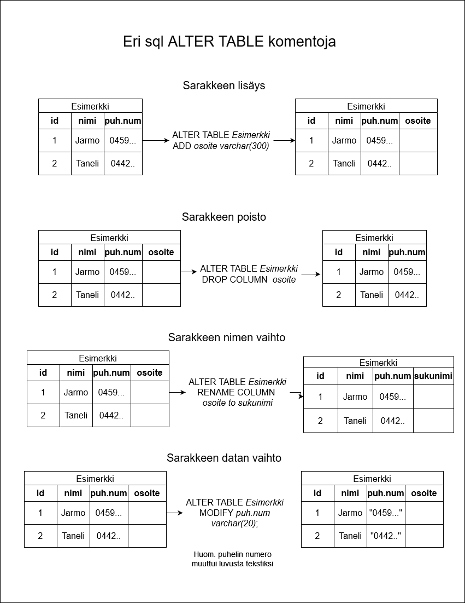

Tehtävät sivulla https://miraavorne.github.io/Databases/

## Tehtävä 1.
Minkälaisia tuloksia löydät omalla etunimelläsi? Entä, minkälaisia tuloksia löydät nimillä Matti ja Maija? Palvelu pyrkii muunmuassa sisällyttämään läheiset nimien muunnokset hakutuloksiin, sillä nimet muuttuvat ajan myötä. 

Omalla etunimellä tuoliksia tuli erttäin paljn jokaisesta kaupungista. Haku sisällytti nimeen Arttu lisäksi Arthur. Vanhoista nimistä suurin osa on Arthur ja ruotsalaisia.

Matti haulla tuli tosi vanhoja tuloksia kuten 1688, ja haki myös nimillä Mathilda,Mats,Mattilas.
Maijalla myös tuli tosi vanhoja kuten 1755, ja nimillä Maijastina,Maja,Maijana,Maijas, Maijaliisa.

## Tehtävä 2.
Pohdi, kuinka moneen palveluun olet syöttänyt sähköpostiosoitteesi? Entä nimesi tai syntymäpäiväsi? Tyypillisesti moni näistä palveluista on erillinen, mutta, tulevaisuudessa tätä tietoa tullaan yhdistämään yhä enemmän ja enemmän paremman yleiskuvan saamiseksi, sekä tilastoihin perustuvien päätösten tekemiseksi.

Liian moneen, luku on todennäköisesti 20- 50 välillä. esim jokainen sosiaalinen media jolla on käyttäjätunnukset ja usein lisäksi jotain muuta esim sähköposti, puhelinnumero sekä nimi.
Lisäksi arvoinoissa todennäkösesti sähköposti mennyt markkinointi listoihin jotka oletettavasti teitokannoissa josta laitetaan automaattisesti massa sähköpostia.
Ja myös kaikenlaisissa kansalais tietokannoissa kuten verotus, omakanta jossa lääkärikäynnit yms.

## Tehtävä 3: Piirrä kaavio
Hahmottele paperille seuraavaan kuvaukseen liittyvä kaavio yllä esitetyllä tavalla. Ota siitä kuva ja siirrä GitHubin SQL repositorioon. Mitkä ovat käsitteet, ja miten ne liittyvät toisiinsa?
Opettajalla on useita kursseja, joita hän opettaa. Jokaiseen kurssiin liittyy ajankohta, jolloin kurssi järjestetään, sekä kurssin käyttämä sali.

Tehtävän vastaus kuv .png)

## Tehtävä4: Hae kaikki
Tee nyt kysely, jolla saat listattua kaikki Kurssisuoritus-taulussa olevat rivit. 

Vastaus: SELECT * FROM Kurssisuoritus

## Tehtävä 5: Hae kurssien nimet
Tee nyt kysely, jolla saat listattua Kurssisuoritus-taulussa olevien kurssien nimet. 
Vastaus: SELECT Kurssi FROM Kurssisuoritus

## Tehtävä 6: Uniikit rivit
Tee nyt kysely, jolla saat listattua Kurssisuoritus-taulussa olevat uniikit kurssit.

Vastaus: SELECT DISTINCT kurssi FROM  Kurssisuoritus

## Tehtävä 7: Hae nimellä
Tee nyt kysely, jolla saat listattua Opiskelija-taulusta kaikki ne opiskelijat, joiden nimi on 'Anna'.

Vastaus: SELECT * FROM Opiskelija WHERE nimi="Anna"

## Tehtävä 8: Hae ehdolla
Tee nyt kysely, jolla saat listattua Kurssisuoritus-taulusta kaikki Pihla-nimisen opiskelijan suoritukset. Voit olettaa, että Opiskelija-taulun sisältö on täsmälleen se, kuin mikä se tähän asti on ollut. Vinkki: millä Pihlan tunnistaa kummassakin taulussa?

Vastaus: Ensin SELECT * FROM Opiskelija WHERE nimi = "Pihla" jotta saa opiskelijan numeron ja sitten SELECT * FROM Kurssisuoritus WHERE opiskelija = 999999 

## Tehtävä 9: LIKE
Tee nyt kysely, jolla saat listattua kaikki Opiskelija-taulussa olevat pääaineet, joissa esiintyy sana "tiede".
Huom! Tee kysely siten, että näet vain uniikit vastaukset. Kyselyn vastauksessa pitäisi olla vain 2 riviä. Kun saat kyselyn toimimaan, kokeile mitä tapahtuu jos muutat 'LIKE'-operaation muotoon 'NOT LIKE'.

Vastaus: SELECT  DISTINCT pääaine FROM Opiskelija WHERE pääaine  LIKE  '%tiede%', NOT LIKE versiolla tuli vain 1 rivi jossa Matematiikka
## Tehtävä 11: Haku useasta taulusta
Tee nyt kysely, joka tulostaa jokaisen opiskelijan nimen, kurssisuorituksen päivämäärän, ja kurssisuorituksen arvosanan.

Vastaus: SELECT nimi,päivämäärä,arvosana FROM Opiskelija,Kurssisuoritus WHERE Opiskelija.opiskelijanumero = Kurssisuoritus.opiskelija

## Tehtävä 12: Tulosten otsikointi
Tee nyt kysely, joka tulostaa jokaiseen kurssiin liittyvän tehtävän. Tulostuksen otsikoiden nimien tulee olla 'kurssi' ja 'tehtävä'.

Vastaus: SELECT Kurssi.nimi AS kurssi, Tehtävä.nimi AS tehtävä FROM Kurssi, Tehtävä,Kurssitehtävä WHERE Kurssi.kurssitunnus = Kurssitehtävä.kurssi AND tehtävä.tunnus = Kurssitehtävä.tehtävä

## Tehtävä 13: Hakujen jäsentely
Tee nyt kysely, joka tulostaa kaikki tehtävät, jotka opiskelija 'Anna' on suorittanut. Tee tulostuksesta sellainen, että yksi sarake sisältää kurssin nimen, ja toinen sarake tehtävän nimen.

Vastaus: SELECT Kurssi.nimi AS Kurssi, Tehtävä.nimi AS Tehtävä FROM Kurssi, Kurssitehtävä, Tehtävä ,Tehtäväsuoritus, Opiskelija
    WHERE  Kurssi.kurssitunnus = Kurssitehtävä.kurssi AND Tehtävä.tunnus = Kurssitehtävä.tehtävä AND Tehtäväsuoritus.tehtävä = Kurssitehtävä.tunnus AND Tehtäväsuoritus.opiskelija = Opiskelija.opiskelijanumero
AND Opiskelija.nimi = "Anna"

## Tehtävä 14: pohdintaa taulujen yhdistämisestä
Vastaus: Toisessa koodissa se ottaa lisäksi kurssitehtäviste ne jotka on oppilailla eikä vain ne jotka on Tehtävä.tunnus = Kurssitehtävä.tehtävä.
# Tehtävä Käsiteanalyysi:
## 1: Kartoita käsite-ehdokkaita.
Rakentamisen  rakentajat, tarvikkeet, työkalut, taukotilat, kohteet, aikataulut

## 2: Karsi ehdokkaita.
Edellisisitä karsisin aikataulut joka vaatisi tietoa kaikista muista.

## 3: Tunnista käsitteiden väliset yhteydet.
No esim rakentajille kaikki on oleellisia tässä yhteydessä. Työkaluille on oleellista tarvikkeet jotta tietää mitä työkaluja olla ja myös rakentajat jotta tietää määrän.
aikatauluille oleellista on kohteet ja rakentajat.

## 4: Määrittele yhteyksiin liittyvät osallistumisrajoitteet.
No työkalulla voi olla vain yksi käyttäjä kerrallaan. Kohteissa tietty määrä osallistujia ja tarvikkeita.

## 5:Täsmennä käsitteitä määrittelemällä attribuutit.
Rakentajilla on attribuutteina nimi,syntymäaika,verokortti, puhelinumero ja sähköposti. Tarvikkeilla on nimi, materiaali, hinta ja laatu. Työkaluilla nimi, käyttötarkoitus, laatu. Taukotiloilla koko, huonekalut, ruokailuvälineen ja kodinkoneet. Kohteilla osoite, valmiusprosentti. Aikatauluilla päiväys, kohteet ja niiden valmiusprosentti, työntekijä määrä.

## Tehtävä 15: Alikyselyt:
Tee nyt kysely, joka listaa kaikki kurssit, joilla ei ole yhtään tehtävää.

Vastaus: SELECT kurssi FROM Kurssitehtävä k WHERE k.kurssi NOT IN (SELECT tehtävä FROM Kurssisuoritus)

## Tehtävä 16:
Tee nyt kysely, jolla lasket kurssisuoritus-taulussa olevat kurssisuoritukset kurssin koodin perusteella. Käytä tulostuksessa sarekkeiden nimiä "kurssikoodi" ja "lukumäärä".

Vastaus: SELECT kurssi kurssikoodi, COUNT(*) AS lukumäärä FROM Kurssisuoritus GROUP BY kurssi

## Tehtävä17 : Yhteenvetokysely
Tee nyt kysely, jossa lasket kurssisuoritus-taulussa olevien kurssien suoritukset -- taas koodin perusteella. Tällä kertaa tulostuksessa tulee kuitenkn tulostaa kurssikoodin sijaan kurssin nimi. Käytä sarakkeiden niminä "kurssi" ja "lukumäärä". (Huomaa, että edellisessä osassa katsotaan kurssitehtäviä, tässä kurssisuorituksia!)

Vastaus: SELECT k.nimi kurssi, COUNT(kt.kurssi) AS lukumäärä FROM Kurssisuoritus kt, Kurssi k WHERE k.kurssitunnus = kt.kurssi GROUP BY k.nimi

## Tehtävä 18: LEFT JOIN
Tee nyt LEFT JOIN -operaatiota käyttäen kysely, jolla listaat kurssikohtaiset suorituslukumäärät siten, että myös ne kurssit, joilla ei ole yhtäkään suoritusta otetaan huomioon. Käytä sarakkeiden niminä nimiä "kurssi" ja "lukumäärä".

Vasaus: SELECT k.nimi kurssi, COUNT(ks.kurssi) AS lukumäärä FROM  Kurssi k LEFT JOIN Kurssisuoritus ks ON k.kurssitunnus = ks.kurssi GROUP BY k.nimi

## Tehtävä 19: Taulun luominen
Luo tietokantaan taulu Kurssi, jolla on sarakkeet kurssitunnus, nimi ja kuvaus.

Vastaus: CREATE TABLE Kurssi (kurssitunnus,nimi,kuvaus)

## Tehtävä 20: Rivin luominen
Lisää nyt tauluun Kurssi kurssi nimeltä "SQL-kielen perusteet", jonka kurssitunnus on "12345" ja kuvaus "SELECT 'Hei maailma';".

Vastaus: INSERT INTO Kurssi (kurssitunnus,nimi,kuvaus) VALUES ('12345', 'SQL-kielen perusteet',"SELECT 'Hei maailma;'") ja varmistus SELECT *FROM Kurssi

## Tehtävä 21: Attribuutteja
Luo ensin tarkasteltava tietokantataulu.
    
Vastaus: CREATE TABLE Tehtävä (tunnus integer, nimi varchar(30), selite varchar(200)) ja tarkastelu PRAGMA TABLE_INFO(Tehtävä)

## Tehtävä 22: PRAGMA
Luo taulu Kurssi, jolla on sarakkeet kurssitunnus, nimi ja kuvaus. Kurssitunnuksen tulee olla kokonaisluku, nimen merkkijono, ja kuvauksen merkkijono. 
  
Vastaus: CREATE TABLE Kurssi (kurssitunnus integer, nimi varchar(30), kuvaus varchar(200)) ja PRAGMA TABLE_INFO(Kurssi).

## Tehtävä 23: Pääaivain
Vastaus: lisää automaattisesti luvun vaikka se ei ole asetettu. Virheviesti sanoo että opiskelijanumeron kuuluu olla uniikki.

## Tehtävä 24: Automaattinen pääavain
Luo taulu Kurssi, jolla on sarakkeet kurssitunnus, nimi ja kuvaus. Kurssitunnuksen tulee olla kokonaisluku, nimen merkkijono, ja kuvauksen merkkijono. Tämän lisäksi, kurssitunnuksen tulee olla pääavain.

Vastaus: CREATE TABLE Kurssi (kurssitunnus integer PRIMARY KEY, nimi varchar(20), kuvaus varchar(200)) ja valittaa että kurssitunnus ei ole uniikki.

INSERT INTO Kurssisuoritus (opiskelija, kurssi, päivämäärä, arvosana, opintopistemäärä)

## Tehtävä 25: Pääavaimet ja viiteavaimet
Toteuta nyt taulut Kurssitehtävä ja Tehtävä siten, että niissä on määriteltynä sekä pääavaimet että viiteavaimet. Pohdi, missä järjestyksessä taulut tulee toteuttaa, jotta saat viiteavaimet määriteltyä oikein.

Vastaukset: Ensin taulujen luonnit, CREATE TABLE Tehtävä (tehtävätunnus integer PRIMARY KEY, nimi varchar(30) NOT NULL, kuvaus varchar(2000)) ja CREATE TABLE Kurssitehtävä (tunnus integer PRIMARY KEY, tehtävä integer NOT NULL, kurssi integer NOT NULL, FOREIGN KEY(tehtävä) REFERENCES Tehtävä(tehtävätunnus), FOREIGN KEY(kurssi) REFERENCES Kurssi(kurssitunnus))

## Tehtävä 26: Viitteiden huomioiminen rivejä lisätessä
Lisää nyt Tehtävä-tauluun muutama rivi, ja määrittele olemassaoleville kursseille muutamia tehtäviä.

Vastaus: Ensin lisäykset tehtäviin INSERT INTO Tehtävä (nimi, kuvaus) VALUES ('Kotiläksy','Tee matikan sivun 30-36 tehtävät') ja INSERT INTO Tehtävä (nimi, kuvaus) VALUES ('Projekti','Tee projekti aiheesta relaatiotietokanta opettajan ohjeiden mukaan')
Sen jälkeen yhdistetään tehtävät ja kurssit. INSERT INTO Kurssitehtävä (tehtävä,kurssi)
VALUES ((SELECT tehtävätunnus  FROM Tehtävä WHERE nimi = 'Kotiläksy'), (SELECT kurssitunnus FROM Kurssi WHERE nimi = 'Tikape')); ja INSERT INTO Kurssitehtävä (tehtävä,kurssi)
VALUES ((SELECT tehtävätunnus  FROM Tehtävä WHERE nimi = 'Projekti'), (SELECT kurssitunnus FROM Kurssi WHERE nimi = 'Ohpe'));
Ei tullut virheitä ja lisäykset onnistuivat.

## Tehtävä 27: ALTER TABLE
Minkälaisia muutoksia W3Schools.com:n mukaan ALTER TABLE -komennolla voi tehdä? Tee mahdollisista komennoista ohjeet esimerkkeineen ja palauta GitHubiin README.md -tiedostoon.

Vastaus: 

# Relaatio tietokanta projekti:
- Aiheena Koulun tietokanta.
- Malli Draw.io
- Vähintään 5 taulua.
- Frontendillä ei väliä (react + electron)
- MySql Tietokantana
